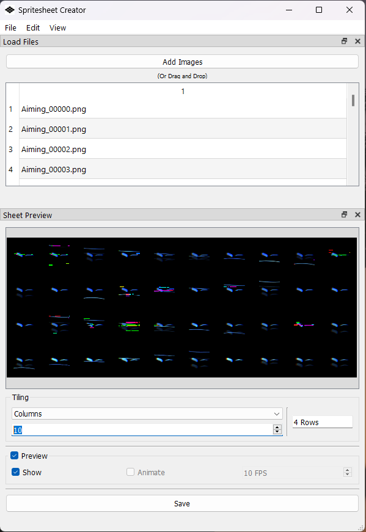

# spritesheet-creator
PNG to sprite sheet creator

Takes PNG files and converts them to a spritesheet of user-defined tile size.  
There is a preview to help tiling if needed. Build with dockable widgets.

## Screenshot

